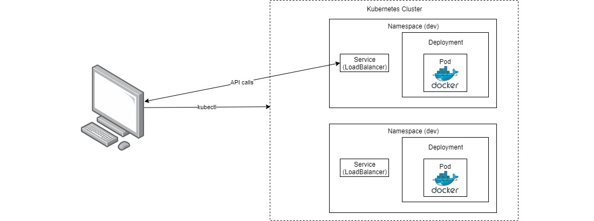

## Kubernetes ABC

The is a small tutorial that will describe how to deploy a small application to kubernetes. The app is deployed to two
environments which is illustrated on the picture at the bottom of the page.  

We will only cover some basic kubernetes features, but for most developers this will be enough.  

Most developers just need an easy way to do the following:
- Deploy an app to multiple environments: dev, test, prod.
- The app should have different environment variables depending on the environment.
- A way to handle secrets, like database username and password.

### Agenda
The workshop is divided in three parts - a folder and readme per folder.
1. [Docker](a-docker)
2. [Kubernetes](b-kubernetes)
3. [Helm](c-helm)

### Prerequisites
You will need some software. You can do it with Choco or manually: 

###### 1. Install with Chocolatey
```bash
# Remember "Run as admin"
choco install docker-desktop -y
choco install kubernetes-helm -y
choco install nodejs -y
``` 

###### 2. Install Manually
- Docker. [Install docker](https://docs.docker.com/docker-for-windows/install/)
- Kubernetes CLI. [Install kubectl](https://kubernetes.io/docs/tasks/tools/install-kubectl/)
    - This might be included in the Docker installation. Test if exists with "kubectl version"  
- Helm CLI ("helm"). [Install helm](https://github.com/helm/helm/releases)
- NodeJs (Optional). [Install node](https://nodejs.org/en/download/) We will run a nodejs app, so that is why you need this
    
